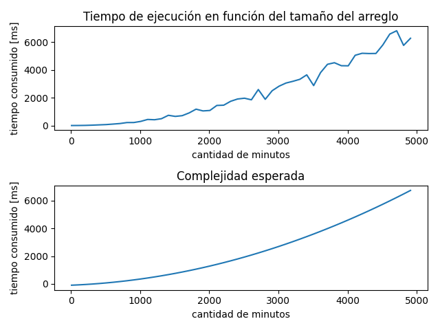
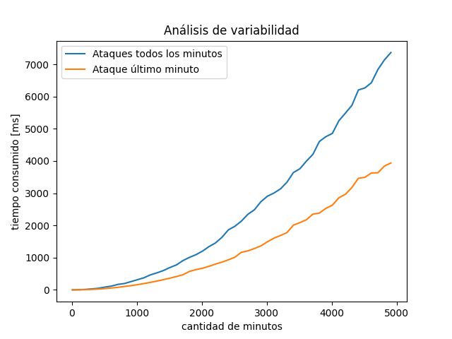

# Objetivo

El objetivo del presente trabajo es idear un algoritmo que indique la estrategia óptima para defender Ba Sing Se del ataque de la Nación del Fuego. El mismo deberá ser implementado mediante programación dinámica. Además, se brindará un análisis completo del problema y del algoritmo en cuestión.

# Análisis del problema

Primero se definen las variables del problema:
- $n$: la duración (en minutos) del ataque enemigo.
- $x_i$: la cantidad de enemigos que llegarán en el minuto $i$.
- $f(i)$: la potencia del ataque de los Dai Li tras ser cargado $i$ minutos.

Además, se debe tener en cuenta lo siguiente:
- Si se decide atacar a los enemigos en el minuto $k$ habiendo pasado $i$ minutos desde el último ataque, el total de bajas enemigas será $\min(x_i, f(i))$.
- Luego de atacar se pierde la carga acumulada.

El propósito será decidir cuáles son los minutos cruciales para atacar a los enemigos y así maximizar sus bajas.

### Análisis de casos bases

Como la solución debe ser implementada con programación dinámica, se comienza observando los casos bases:
- $n=0$: no hay ataque, no hay bajas enemigas.
- $n=1$: al ser la única oportunidad de ataque, se realiza el mismo provocando $\min(x_1, f(1))$ bajas enemigas.

- $n=2$: como **no tiene sentido no atacar en el último minuto**, las posibles estrategias son atacar en ambos minutos (Atacar, Atacar) o cargar el ataque en el primer minuto y atacar en el segundo (Cargar, Atacar). Se elegirá aquella que cause mayor daño al enemigo, en otras palabras:
$$\max(\min(x_1,f(1))+\min(x_2, f(1)), \min(x_2, f(2)))$$

- $n=3$: se tiene el doble de estrategias posibles con respecto al caso anterior:
    - **Atacar**, **Atacar**, Atacar
    - **Cargar**, **Atacar**, Atacar
    - Atacar, Cargar, Atacar
    - Cargar, Cargar, Atacar

    Puede notarse que las primeras dos estrategias tienen como subproblema el del ítem anterior, y como una vez que se ataca se reinicia la carga del ataque sin importar todo lo que vino antes, entre estas dos opciones se deberá elegir la que más enemigos haya eliminado. Esto mismo ya ha sido calculado en el paso anterior con $n=2$.

    El problema no termina ahí, pues puede ser que la estrategia óptima se encuentre entre la últimas dos. De manera similar a lo mencionado anteriormente, ambas incluyen un subproblema anterior, en este caso con $n=1$ y $n=0$. También será necesario tener en cuenta que la carga irá creciendo ya que es una función monótona creciente.
    Resumiendo, para obtener el óptimo se puede escribir la ecuación:
$$\max(OPT(0) + \min(x_3,f(3)), OPT(1) + \min(x_3, f(2)), OPT(2) + \min(x_3, f(1)))$$

#### Ecuación de recurrencia
Extrapolando esta última ecuación para cualquier $n$, se obtiene la ecuación de recurrencia del problema:

$$
OPT(n) = \max_{0\le k\lt n}\left(OPT(k) +\min(x_{n},f(n-k))\right)
$$

### Algoritmo propuesto

En base a todo lo analizado previamente se propone el siguiente algoritmo para obtener $OPT(n)$:
1. **Obtener los óptimos para cada subproblema**
    + Se inicializan todos los óptimos en 0.
    + Se itera por cada minuto $i$ desde 1 hasta $n$.
    + En cada iteración se calcula $OPT(i)$ aplicando la ecuación de recurrencia (utilizando los óptimos calculados previamente).

2. **Construir la estrategia**:
    + Se empieza desde el último minuto y se agrega a la solución (ya que siempre se ataca).
    + Se busca cuál fue el minuto donde se atacó previamente para llegar al óptimo final.
    + Nuevamente se agrega a la solución y se repiten los pasos anteriores a partir de este nuevo minuto agregado hasta llegar al 0.
    + Por último, se invierte el orden la solución para que quede de menor a mayor.
  

# Algoritmo y complejidad
A continuación se expone el código del algoritmo junto con el respectivo análisis de complejidad.

## Implementación

```python
# Código en main.py

def obtener_optimo(enemigos, potencias):
    n = len(enemigos)
    optimos = [0]*(n+1)
    for i in range(1, n + 1):
        maximo = 0
        for k in range(i):
            valor_actual = optimos[k] + min(enemigos[i - 1], potencias[i - 1 - k])
            maximo = max(valor_actual, maximo)
        optimos[i] = maximo
    return optimos

def construir_estrategia(enemigos, potencias, optimos):
    solucion = []
    i = len(enemigos)
    while i > 0:
        solucion.append(i)
        for k in range(i):
            valor = optimos[k] + min(enemigos[i - 1], potencias[i - 1 - k])
            if valor == optimos[i]:
                i = k
                break    
    solucion.reverse()
    return solucion
```

## Análisis de complejidad
El algoritmo consta de dos partes: 

1. **Obtener los óptimos para cada subproblema**: 
    + Iterar por cada minuto $i$ (un total de $n$ veces): $\mathcal{O}(n)$ 
    + En cada iteración $i$ aplicar la ecuación de recurrencia. Para esto se itera por las soluciones de los $k$ subproblemas ya calculados: $\mathcal{O}(k)$
    
    Como $k \le n$, la complejidad temporal de esta parte queda en $\mathcal{O}(n)\cdot \mathcal{O}(k) = \mathcal{O}(n)\cdot\mathcal{O}(n) =\mathcal{O}(n²)$.


2. **Reconstruir la estrategia a partir del arreglo de óptimos**:
    + Buscar cómo se llegó al óptimo actual entre las propuestas de los subproblemas anteriores (búsqueda lineal): $\mathcal{O}(n)$ 
    + Repetir lo anterior desde el minuto resultado de la búsqueda hasta llegar al inicio ($m$ veces para una solución de $m$ ataques): $\mathcal{O}(m)$

    Como $m\le n$, la complejidad queda como $\mathcal{O}(n)\cdot\mathcal{O}(m) = \mathcal{O}(n)\cdot\mathcal{O}(n) = \mathcal{O}(n²)$

Complejidad total: $\mathcal{O}(n²) + \mathcal{O}(n²) = \mathcal{O}(n²)$ en función del tamaño de los arreglos de entrada.

# Análisis de variabilidad de $x_i$ y $f(\cdot)$
Se detectaron dos casos particulares:

### Ataque con carga mínima elimina cualquier oleada de enemigos
En otras palabras, $f(1) \ge x_i \forall i$. En este caso no hay diferencia entre cargar el ataque o no, pues siempre se terminan eliminando la misma cantidad de enemigos. Por ende, la mejor opción siempre será _atacar en todos los minutos_ y la _cantidad total de bajas enemigas será equivalente al total de enemigos_.

No afecta a la complejidad debido a que la primera parte del algoritmo no logra salvarse de iterar para obtener todos los óptimos correspondientes para cada minuto. 
Cabe mencionar que si bien no afecta a la cota de la complejidad total, al atacar en todos los minutos se encontrará en el peor caso de la reconstrucción de la solución al tener que realizar operaciones lineales por cada minuto.

Tampoco es una situación que afecte la optimalidad del algoritmo, pues al tratarse de programación dinámica este _explora de manera implícita todo el espacio de posibles soluciones_. Siempre eligirá las opciones que más le convengan para cada subproblema y podrá detectar con facilidad que atacar varias veces con el mismo impacto será mejor que cargar el ataque y conseguir un resultado menor. 

Además, se discutió la idea de modificar el algoritmo general de la siguiente manera:

```python
if potencias[0] >= max(enemigos):
   return obtener_optimos_optimizado(enemigos, potencias)
else:
    return obtener_optimos(enemigos, potencias)
```

Se llegó a la conclusión de no incluir esta estructura condicional ya que chequear la condición del _if_ es $\mathcal{O}(n)$ debido a la función _max_ de Python, y en balance no es conveniente tener que realizar esta operación para todos los casos posibles simplemente para optimizar uno muy puntual.

### Solo se ataca en el último turno
Si bien se trata de un caso muy particular, resulta interesante por la drástica reducción en complejidad de la reconstrucción de la solución. La misma pasa a ejecutarse en $\mathcal{O}(1)$ ya que al tratarse de un único ataque y por la forma en la que el algoritmo se encuentra implementado, no es necesario iterar por todas las soluciones a los subproblemas anteriores.

Sin embargo, al igual que el caso anterior, no afecta la complejidad total pues para la obtención del óptimo se mantiene en $\mathcal{O}(n²)$.

# Casos de prueba
Se realizaron varios ejemplos de ejecución para validar la eficacia y optimalidad del algoritmo implementado. Además de los proporcionados por la cátedra, se incluyeron casos adicionales para verificar la cobertura y robustez del mismo. Estos se encuentran en la carpeta _ejemplos_ del repositorio.

Los casos de prueba abarcan diversas situaciones para identificar posibles fallos y asegurar el funcionamiento del algoritmo en escenarios no contemplados inicialmente. Entre los ejemplos de ejecución se encuentran:

- **Vector vacío**: para asegurar que el algoritmo maneje correctamente la situación sin enemigos.

- **Un solo valor**: para aseverar que el algoritmo ataque ante una sola tropa de enemigos.

- **Dos valores**: para confirmar que el algoritmo elija la mejor opción entre cargar y atacar o atacar y atacar ante la llegada de dos tropas de enemigos.

- **Distintos patrones de enemigos**: entre ellos se incluyen cantidades de enemigos crecientes, decrecientes, constantes y variaciones extremas. Estos casos aseguran que el algoritmo maneje correctamente estas situaciones y elija sabiamente cuándo atacar y cuándo cargar.

- **Valores muy grandes**: para probar la resistencia del algoritmo ante valores altos y detectar posibles problemas de precisión.

Para evaluar la optimalidad se desarrolló un algoritmo de backtracking y una función auxiliar para calcular la cantidad de tropas eliminadas dada una determinada estrategia. El código de ambos se encuentra en _utils.py_ y los tests realizados en _tests.py_.

El algoritmo respondió satisfactoriamente a todos estos casos, demostrando su eficacia y capacidad de adaptarse a una amplia gama de situaciones. Esto indica que el algoritmo es óptimo en todos los escenarios evaluados.


# Mediciones
Se realizaron una serie de mediciones para comprobar la complejidad del algoritmo.
Para ello se generaron muestras aleatorias de $x_i$ y $f(\cdot)$ de tamaño $n$, yendo de 10 a 5000 elementos de a pasos de 100 y se fue midiendo el tiempo consumido. Para reducir el ruido de las mediciones, por cada tamaño se realizaron 5 mediciones y se calculó su promedio. Para graficar la complejidad teórica esperada, que en este caso era cuadrática, se ajustaron las mediciones a una parábola mediante el método de cuadrados mínimos.



Podemos observar que hay una similitud notable entre los gráficos, confirmando experimentalmente que la complejidad del algoritmo es cuadrática.

Para el siguiente gráfico se repitió la experiencia anterior para los casos mencionados
en el [análisis de variabilidad de $x_i$ y $f(\cdot)$](#análisis-de-variabilidad-de--y).


<!-- TO DO -->

# Conclusiones
Tras haber realizado todos los análisis, ejemplos y mediciones correspondientes, se puede concluir que:
- El algoritmo propuesto obtiene siempre la solución óptima al problema en
cuestión para todos los casos posibles. La variabilidad de los valores de $x_i$ y $f(\cdot)$
no afecta la optimalidad del mismo.
- La complejidad del algoritmo en general es $\mathcal{O}(n²)$. Experimentalmente se logró apreciar esta tendencia.
- Existe un caso particular () en el cual
se reduce la complejidad algorítmica de la reconstrucción de la solución a O(1).